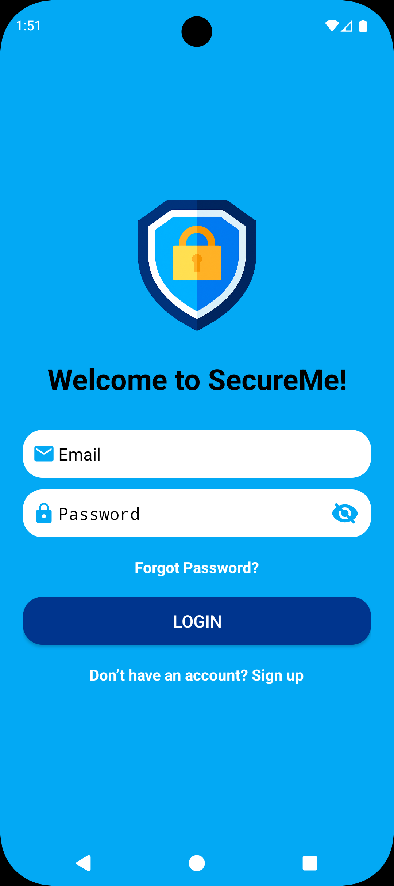
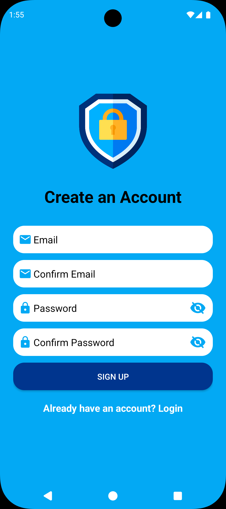
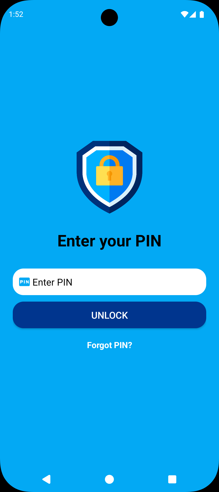
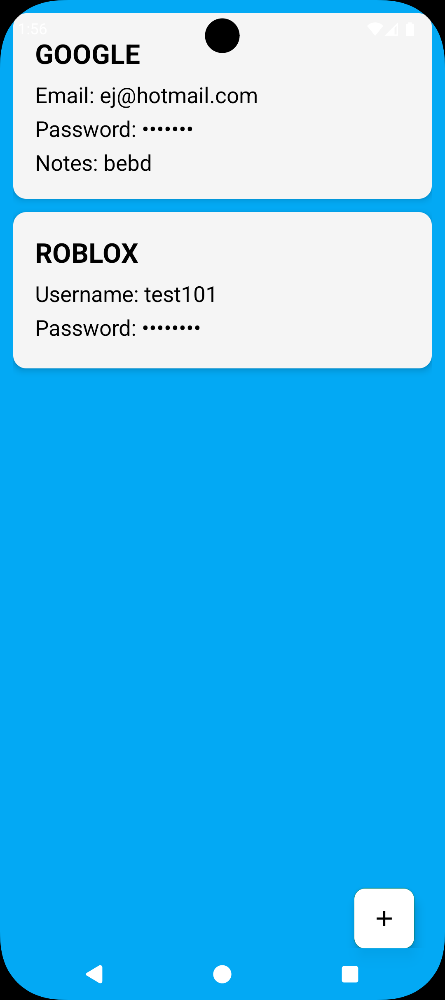
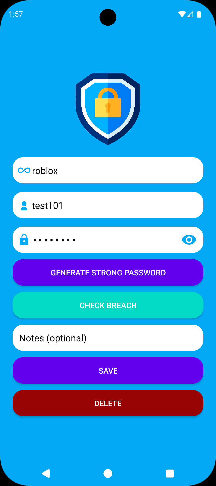

# 🔒 SecureMe

SecureMe is an Android password manager that enables users to securely store, organize, and protect their usernames, email addresses, and passwords. The application combines modern encryption techniques, biometric authentication, and cloud storage to provide a secure and convenient solution for managing sensitive login credentials.

## ✨ Features

- 🔐 Secure storage of usernames, email addresses, and passwords
- 🔑 Strong password generator
- ⚠️ Password breach detection using the Have I Been Pwned API
- 👆 Biometric authentication (Fingerprint / Face ID)
- 🔢 Second-layer PIN security
- 🔒 AES-256 encryption for stored credentials
- 🔐 SHA-256 hashing for PIN protection
- ☁️ Cloud synchronization using Firebase Firestore
- 📱 Simple and user-friendly interface

## 📋 Credential Management

SecureMe provides complete CRUD functionality for managing stored credentials.

- ➕ Create new credentials
- 👁️ Securely view saved credentials
- ✏️ Update existing credentials
- 🗑️ Delete credentials permanently

## 🛠️ Technologies Used

- Java
- Android Studio
- XML
- Firebase Authentication
- Firebase Firestore
- Firebase Cloud Storage
- AES-256 Encryption
- SHA-256 Hashing
- HttpURLConnection
- Gradle

## 🔐 Security

SecureMe is built with security as its primary focus.

- AES-256 encryption protects stored credentials.
- SHA-256 hashing secures the user's PIN.
- Biometric authentication provides fast and secure access.
- A second-layer PIN adds extra account protection.
- Firebase Firestore securely stores encrypted user data in the cloud.

## 📁 Project Structure

```text
SecureMe/
├── app/
├── gradle/
├── build.gradle.kts
├── settings.gradle.kts
├── gradlew
├── gradlew.bat
└── README.md
```

## 🚀 Installation

### Prerequisites

- Android Studio
- Java Development Kit (JDK)
- Android SDK

### Steps

1. Clone the repository.

```bash
git clone https://github.com/ejpadullo/SecureMe.git
```

2. Open the project in Android Studio.
3. Allow Gradle to sync all dependencies.
4. Build and run the application on an Android emulator or physical Android device.

## 📸 Screenshots

| Login | Register |
|-------|----------------|
|  |  |

| Pin | Password Vault |
|--------------------|----------------|
|  |  |

| Add Credential |
|----------------|
|  |

## 📝 Note

This project was developed for educational and portfolio purposes. The source code is publicly available to demonstrate the application's design and implementation.
